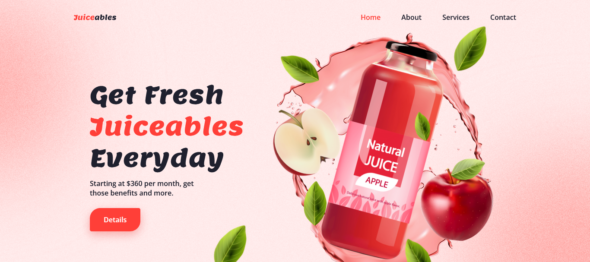

<h1>Juice Landing Page</h1>

<h2>A landing page created using HTML, CSS, and JavaScript.</h2>

This landing page created using HTML, CSS, and JavaScript to show the and close the navbar, and animation using GSAP. I created this following the tutorial of Bedimcode. Screenshot of the landing page.

- Live Site: [Juice Landing Page](https://juice-landing-page.netlify.app/)

### Screenshot

